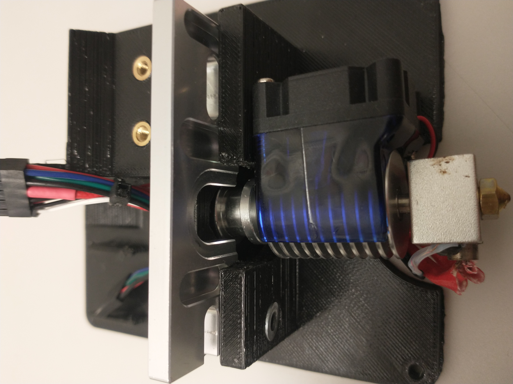
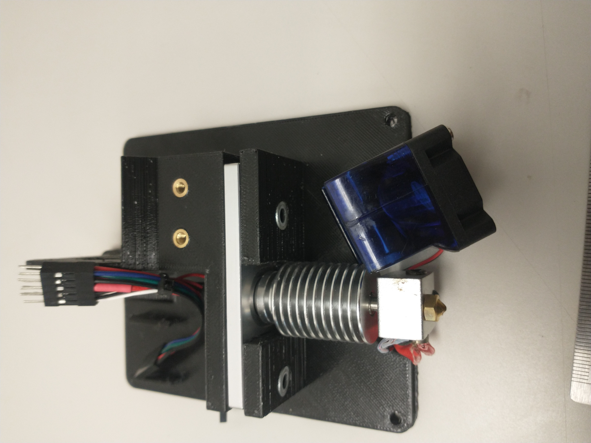

# Assembly Instructions
### Materials
You will need the following to assemble the hotend
* A generic e3d v6 hotend. Clones are available online for around $20, but make sure to get one with a 24v heater cartridge
* Two M3x20 bolts, two M3x10 bolts, and four M3 nuts (for DaVinci2000's part cooler shroud)
* A 5015 "squirrel cage" blower fan (for the part cooler)
* Some short wires, about 22AWG
* Pin headers
    * a 4-pin header for the stepper, a 2-pin header for the part cooler fan, and a 2x8 header for the TAZ hotend connector - I used two smaller headers side-by-side, a 2x3 for the thermistor and a 2x5 for everything else
* The old hotend/extruder from your TAZ 5
* A generic bowden extruder
* Some bowden tube (58mm long)
### Prep
1. Print inlcuded stl files, ideally in PETG or ABS.
2. Remove the extruder and french cleat from the TAZ and dissassemble, keeping all hardware handy.
3. Assemble the e3d v6 hotend in its entirety, routing the hotend cartridge and thermistor cables sideways away from the nozzle, then loosely upwards as shown. Attach the heatsink fan shroud on the opposite side from the cartridge and thermistor cables.

4. Cut and splice wires to length as shown below. Optionally, re-splice a new 4-pin connector onto the stepper motor - I did this to tidy the wires, leaving about 1 inch to the stepper.

    * Note that I terminated the stepper differently from LulzBot - the diagram shows the correct pinout for LulzBot's stepper, but the pictures show my wiring.
5. Heat-set two 5mm M3 inserts in the holes on the main plate (inserts can be salvaged from the TAZ's old part cooler mount)

### Mounting the e3d v6 hotend
1. Insert the hotend connector through the back side of the plate so that it comes out above the extruder mount

2. Pull through the connectors for the part cooling fan and stepper.

3. Tuck the hotend under the bottom of the plate, and upwards loosely into its mount. The wires should tuck into the channel along the back.

4. Insert the aluminum bracket from the original extruder, upside-down, into the slot between the "shelves" of the hotend mount. It should push the hotend snugly into the top shelf cutout.

5. Insert the two larger (M4?) bolts, nuts, and washers from the original extruder to hold the bracket in place. You may need to temporarily un-clip the fan from the heatsink to insert the right-side bolt. The fan should just clear the head of the bolt when clipped back on.

### Mounting the extruder
1. Route the connectors for the stepper motor and part cooler fan behind the stepper support pillar.

2. Cut the bowden tube to 58mm and straigthen. I used a vee router bit to chambfer the inside edge connecting to the extruder.

3. Partially assemble the extruder - attach the bolt for the spring and the PTFE connector.

4. Insert the bowden tube fully into the heatsink, and slide the extruder body onto the protruding ~1cm end. The extruder body should line up with the stepper mounting holes, with ~2mm to release the PTFE connectors if needed.

5. Slide the stepper into position, wires pointing down. Slide the extruder gear onto the stepper shaft and tighten its set screws.

6. Insert the flat-head bolt and the two short cap-head bolts for the extruder and tighten onto the stepper.

7. Attach the extruder lever using its long bolt. Squeeze the spring into position.

8. Connect the extruder to the wire harness.

### Mounting the assembly onto the TAZ
1. Insert the top bolt, hanging the plate off of it. Slide the plate up and insert the bottom two corner bolts (from the french cleat used in the prior design). The middle two bolts will not be used. Tighten all three.

2. Connect the hotend cable and slide into the upper-left corner mount.

3. Calibrate your z endstop bolt. You will likely have to remove the spring and washers - I used some poster putty to fix it in place without them.

### Mounting the part cooler
1. If it doesn't already have one, crimp a pin header onto the fan. I left my fan's wires about 65mm long.

2. Insert the fan into the shroud. It should fit snug.

3. Using the M3x10 and M3x20 bolts and M2 nuts, attach the fan mount bracket as shown. The longer bolts will attach the fan, and the shorter will connect to the shroud.

4. Using the bolts from the original part cooling shroud, attach the fan bracket to the extruder plate. Adjust height as needed, then tighten the bolts.

5. Plug the fan into the wire harness.

### Config Changes
1. On the TAZ, under Configuration > Advanced Settings, set your Esteps/mm. I set mine to +0098.0 but yours may be slightly different depending on the extruder gear - see [this guide](https://all3dp.com/2/extruder-calibration-calibrate-e-steps/) for help calibrating.
2. Make sure to change the filament diameter in your preferred slicer - the repo contains a config for PrusaSlicer in "CONFIG/" (which I believe will work in regular Slic3r), and I will add one for Cura soon.