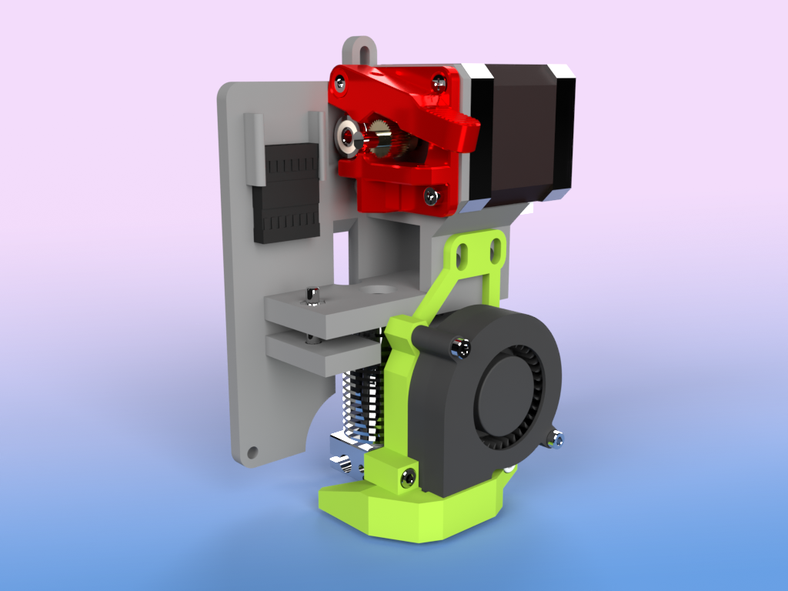

# TAZ5-e3dv6-hotend
Direct drive extruder using generic e3dv6 hotend parts for 1.75mm conversion on Lulzbot TAZ 5

CONFIG contains slicer presets. DOCS contains assembly instructions.

Files are also mirrored on [Thingiverse](https://www.thingiverse.com/thing:6055612) and [Printables](https://www.printables.com/model/495617-taz-5-175mm-conversion-using-e3d-v6)

Part cooling fan adapted from [E3D v6 CFD optimized adjustable part cooling duct](https://www.thingiverse.com/thing:3590464) by DaVinci2000 on Thingiverse
Mount adapted from original LulzBot part [extruder_mount_hex](https://download.lulzbot.com/TAZ/5.0/production_parts/printed_parts/extruder_mount_hex/)
